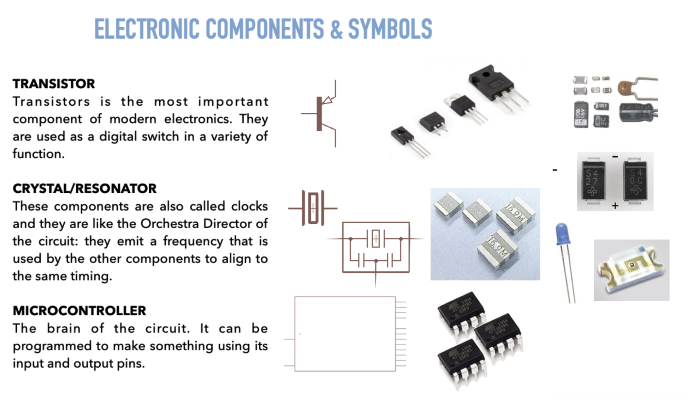

# Baking bread? no, breadboard!

## How I learnt what the Arduino components are by re-creating the Arduino on a breadboard
Reproduce the Arduino electronic structure on a breadboard. Feels a bit like a reverse engineering process

## Documentation

Basic instructions I had to go through
* Pick the single components and understand what they are and how they work
* Understand the functioning of the breadboard
* Follow the steps to place the components one by one and understand/take notes of how they stay together. For this task, we followed the process illustrated [in this tutorial(https://www.digikey.com/en/maker/projects/build-your-own-arduino-breadboard/f243b09293ae4e3189bda47a821bb97a)]

This is the list of the components we used
1. Crystal
2. item two
3. item three

We first analysed the Arduino board trying to locate the components we were using. I tried to keep up with a sketch about the position and descriptions to clarify the structure in my mind
**upload image from notebook**

I have many notes about units of measure of electricity. I get the general idea but still I need to dive more into this. It feels blurry in the mind.
**upload image from notebook**

For the first day, the challenge was understanding  

**Issues in the process**
* Being the subject very new I went through several phases of "how to take the notes in proper way"
* I definitely need a refresh of general electronics. The [Getting Started in Electronics by Forrest Mims](https://docs.google.com/document/d/1CzgxV9jVUBEU-Pi_BUT0c7RpolK1Asxq6KA_zzXLP7U/edit) is very good but a bit too didascalic and abstract. So i found other resources I will check out like [Udemy](https://www.udemy.com/topic/electronics/) or [EDX](https://www.edx.org/learn/electronics) or [Open Edu](https://www.open.edu/openlearn/science-maths-technology/an-introduction-electronics/content-section-0?active-tab=description-tab)
* Keys and components are tiny! I am not used to it. But I guess it will help concentration
* Mental and physical focus are both challenging

*italic text*

example of an external link

example of a picture hosted on an external website

example of a picture hosted inside your repository (don't forget the ./ operand)

